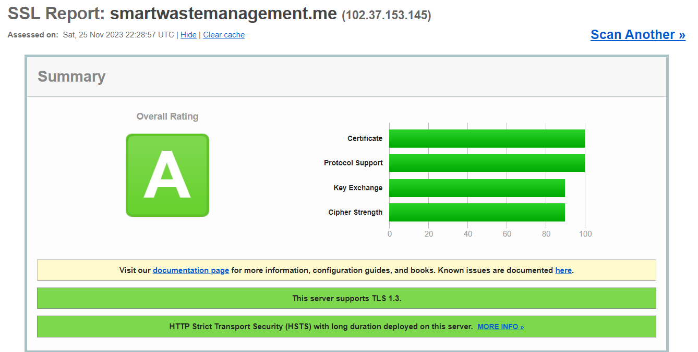

# CoTproject

This project was realized as part of the Cloud of Things module at Sup'Com, dedicated to monitor pollution in cities to help municipalities.
This project was done by:
- **Sarra Hammami** (sarra.hammami@supcom.tn)
- **Asma Abidalli** (asma.abidalli@supcom.tn)

The Smart Garbage Collection System is an innovative solution designed to optimize waste management processes, reduce operational costs, and contribute to a cleaner environment. By leveraging IoT technologies, data analytics, and real-time monitoring, this system intelligently manages garbage collection in urban areas.

## Context

This project proposes an IoT-based smart system for efficient waste management, addressing the challenges associated with traditional methods. The system employs innovative sensory technologies to assess the fill levels of dustbins, optimizing the waste collection process. The essence of this approach lies in its ability to analyze past waste generation and fill level trends, which, in turn, optimizes collection routes, reduces fuel expenditures.

## Technologies

These are the technologies necessary to run this project:

- Wildfly 30.0.0.final
- JDK 21
- Node-red
- Mosquitto Broker
- Raspberry pi 4
- MongoDB
- leaflet(OpenStreetMap) api 
- HC-SR04 ultrasonic sensor
  

